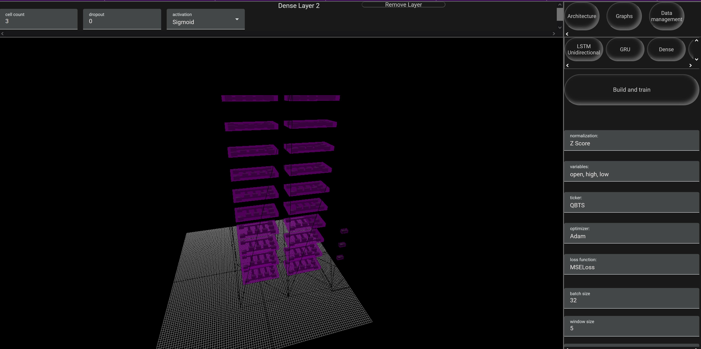

# Peek: a browser-based GUI


Peek is a web-based UI for machine learning predictions on stock data. This project aims to provide a robust, interactive toolset for forecasting and analyzing stock data through machine learning and statistical methods. Currently, this project supports the following:


#### Layers:
- Unidirectional long-short-term memory
- Gated recurrent unit
- 1D convolution
- 1D max pooling
- Multi-head attention
- Linear/Dense


#### Hyperparameters:
- Normalization method
- Variables being predicted
- Stock ticker being forecasted
- Optimization algorithm
- Batch size
- Window size
- Epochs
- Learning rate
- Training, testing, and validation split ratio
- Prediction steps
- Cell count (any layer)
- Dropout (LSTM, GRU, MHA, and Linear)
- Activation function (LSTM, GRU, MHA, and Linear)
- Kernel size (1D convolution and 1D max pooling)
- Filters (1D convolution and 1D max pooling)
- Stride (1D convolution and 1D max pooling)
- Padding (1D convolution and 1D max pooling)
- Dilation (1D convolution and 1D max pooling)


#### Graphs
- Model accuracy
- Model loss
- Model prediction
- 3D model architecture


## Prerequisites
Since this project is built out of Python and Angular using Node and Angular CLI V19, you are going to need `Python 3.1.5` and `Node.js v22.5.1` installed to continue alongside their respective package managers, pip and npm. There are also external dependencies that need to be installed on both sides:


### Python:
#### (Torch's actual version is 2.2.2+cu118)
```
pip3 install Torch==2.2.2
pip3 install numpy==1.24.3
pip3 install pandas==1.5.3
pip3 install flask==3.0.3
```
### Node:
```
npm install -g @angular/cli@latest
cd ./AngularPeek
npm install
```
## How do I launch the application?
If you are using Windows, there are two batch files called `StartAPI.bat` and `StartApp.bat`; launch them both, and when Angular is ready, it will open a new tab with the application. If you are on Linux or MAC, the two commands to start the app are `python API.py` and `ng serve`


## Navigation
There are three buttons at the top right of the UI, each taking you to the architecture constructor, available graphs, and data management, respectively.


## Data management
On a fresh install, there won't be any JSON files containing market data to provide to a custom architecture. So to get started, type in the ticker of the stock you want to forecast, click add/remove, and it will be added to / removed from a queue of tickers that will be downloaded. Below, you will need to specify a starting and ending date through the two calendars on the bottom left and the type of interval in minutes, hours, days, etc Additionally, optionally, you can select/deselect a checkbox that will replace any pre-existing data for any ticker in the queue.


## Architecture and Three.js 3D Space
After navigating to the architecture menu, there will be a few options to add layers populated below the menu navigation bar:


Once you click on a chosen layer, the layer will populate in the 3D space at the center of the screen, and each layer will have its own 3D representation or 3D model detailing the forward propagation mathematics for each cell:


The layer recently added will automatically be the currently selected layer. To the right of the 3D space, there will be a sub-menu controlling the selected layer's parameters like cell count, dropout, activation, etc. If you choose to tune these parameters, the scene will re-render and reflect the changes, depending on whether it affects the shape of the layer. For example, each layer starts with 10 cells and 10 instanced 3D models for the layer to represent each cell. If you change the cell count to 15, there will now be 15 instanced 3D models representing the cell count. If you want to remove a layer, you will need to remove all preceding layers first, since you can only remove the last layer due to the sequential ordering of the network on the backend.


To move around in the 3D environment, use WASD to control forward, left, back, and right camera movement, the left mouse button to rotate the camera, and the shift key to speed up the WASD movement. There is also a raycaster built into the left mouse button to select different layers within the network to tune a targeted layer, to select another layer, just left click, and the changes will reflect on the parameter sub-menu.


### Basic network example:
#### LSTM(12) -> LSTM(6) -> Linear(3)



### Considerations
With any machine learning task, the internal details of your architecture change with the type of problem and data provided. Most of the heavy work is handled by a custom wrapper around PyTorch, but you will still need to tune some layer variables in the front-end for the network to turn out how you wanted:


- If you have a dense layer, make the number of cells (output) equal to the number of variables (if open, high, and low are selected the cell count should be 3)


- If you have a 1D convolution, 1D pooling, or multihead attention layer feeding into another 1D convolution, 1D pooling, or multihead attention layer, then make sure the cell count for the next layer is equal to the output shape of the previous layer.


   
#### Note that there is currently no system to save models, so if there is an architecture pattern that works well for you then save a screenshot of it and rebuild the network next time you want a similar result. There are plans in the near-future to add a model save, load, and delete system.


As for the prediction itself, there are a lot of factors you can control that have their independent influence. The hyperparameters that have the largest influence are:
- Window size (influences the size of the context window that the network takes into account)
- Cell counts (too few can underfit and too many can overfit)
- Dropout (helps mitigate overfitting and forces the network to learn alternative features)
- Normalization (affects the magnitude of the data that the network will pick up on)